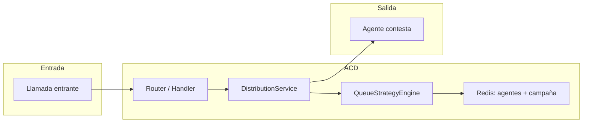
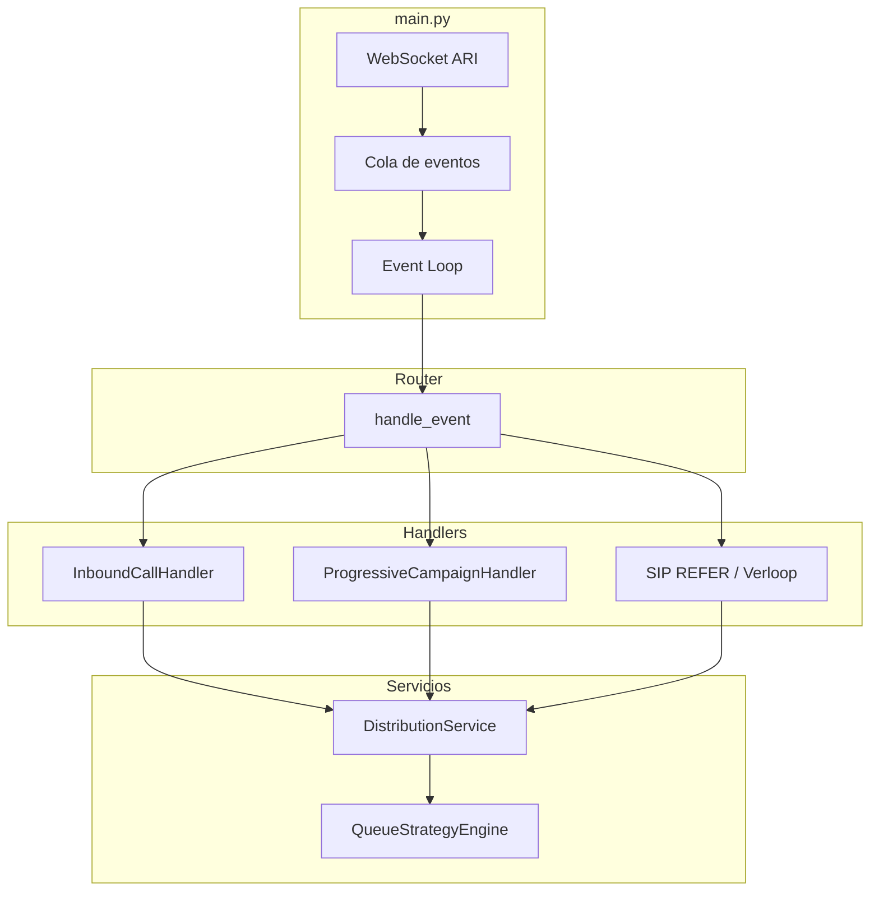
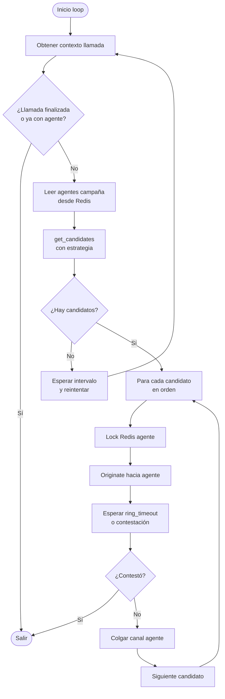
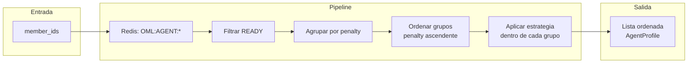
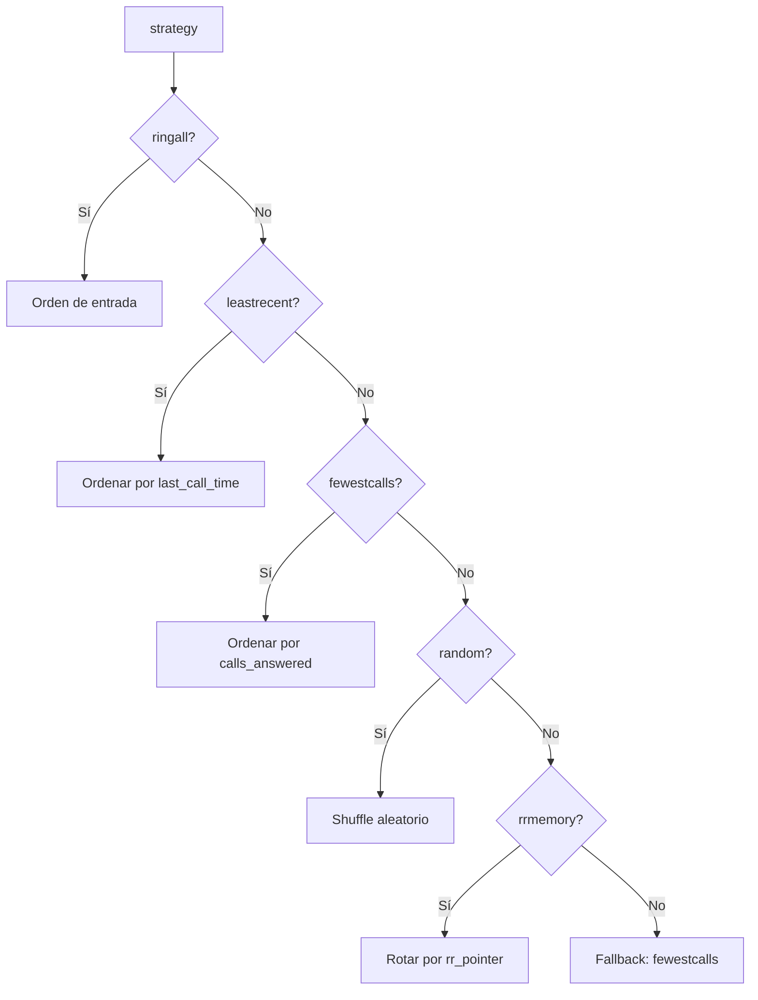

# Estrategias de cola y distribución de llamadas (ACD)

Este documento describe el algoritmo de distribución de llamadas sobre colas de espera del **acd-server**, incluyendo el flujo de eventos, el motor de estrategias y el comportamiento de cada estrategia de *deliver*.

---

## 1. Visión general

El ACD recibe llamadas (inbound o desde campañas/dialer), las coloca en un *bridge* con MOH y ejecuta un **bucle de distribución** que intenta entregar la llamada a agentes de la campaña/cola. La **estrategia** determina **en qué orden** se intentan los agentes; la entrega es siempre **secuencial** (un agente a la vez).

---

## 2. Flujo de componentes

Los eventos ARI llegan por WebSocket al `main.py`, se encolan y el **Event Loop** invoca al **Router**. El Router deriva a los handlers (Inbound, Campaign, SIP REFER, etc.), que inician la distribución mediante `DistributionService.start_distribution()`.

- **DistributionService**: orquesta el bucle de distribución, timeouts de cola y notificaciones (contestó / falló).
- **QueueStrategyEngine**: obtiene desde Redis los datos de los agentes, filtra por estado READY y devuelve la lista de candidatos **ordenada** según la estrategia configurada.

---

## 3. Bucle de distribución

`DistributionService._run_distribution_loop()` es el núcleo del algoritmo:

1. Obtiene los IDs de agentes de la campaña desde Redis (`OML:CAMP:{id_camp}` / conjunto de agentes).
2. Llama a `QueueStrategyEngine.get_candidates(queue_name, member_ids, strategy)` y recibe una lista **ordenada** de candidatos (solo agentes READY).
3. Para **cada** candidato en ese orden:
   - Reserva el agente con un lock Redis (`acd:lock:agent:{agent_id}`).
   - Origina hacia el agente (`dial_agent_with_headers`).
   - Espera hasta `ring_timeout` segundos a que el agente conteste o se produzca fallo (eventos ARI).
   - Si no hay respuesta a tiempo: cuelga el canal del agente, libera el lock y **pasa al siguiente candidato**.
   - Si el agente contesta: el handler marca la llamada como atendida y se detiene la distribución (`stop_distribution` o salida natural del loop).

Importante: **no se hace “ring-all”** (suena a todos a la vez). La estrategia solo define el **orden** en que se intentan los agentes; la entrega es siempre de **uno en uno**.

---

## 4. Motor de estrategias (QueueStrategyEngine)

La estrategia se configura por campaña en Redis (clave de configuración de campaña, campo `strategy`). Valor por defecto: **fewestcalls**.

### 4.1 Datos de entrada

- **Miembros de la campaña**: IDs de agentes obtenidos del conjunto Redis de la campaña.
- **Perfil por agente**: se lee `OML:AGENT:{agent_id}` (hash con `status`, `penalty`, `calls_answered`, `last_call_time`, `sip`/`sys_class`).
- Solo se consideran agentes en estado **READY** (los demás se descartan en `_build_agent_profile`).

### 4.2 Agrupación por penalidad

Los candidatos se agrupan por **penalty** (prioridad). Primero se devuelven los de **menor penalidad**; dentro de cada grupo se aplica la estrategia.

### 4.3 Estrategias disponibles

| Estrategia     | Descripción | Criterio de orden |
|----------------|------------|-------------------|
| **ringall**    | Sin reordenar por métricas. | Se mantiene el orden de entrada del grupo. |
| **leastrecent**| Quien más tiempo lleva sin atender. | `last_call_time` ascendente (el que hace más tiempo que no atiende va primero). |
| **fewestcalls**| Equilibrado por carga. | `calls_answered` ascendente (quien menos llamadas ha atendido va primero). **Default**. |
| **random**     | Aleatorio. | `random.shuffle` del grupo. |
| **rrmemory**   | Round-robin con memoria. | Se usa el puntero `queue:{queue_name}:rr_pointer` en Redis; se rota el grupo para que el siguiente al último agente atendido quede primero. |

Si la estrategia no es reconocida, se aplica **fewestcalls** y se registra un warning.

---

## 5. Métricas y actualización tras la llamada

Cuando un agente **contesta**, el handler notifica a `DistributionService.handle_agent_answer(call_id, channel_id)`. Al finalizar la llamada (o en el flujo de limpieza), se llama a `QueueStrategyEngine.update_stats_after_call(agent_id, queue_name)`, que actualiza en Redis:

- **calls_answered** / **CALLS_ANSWERED**: incremento en 1.
- **last_call_time** / **LAST_CALL_TIME**: timestamp actual.
- **queue:{queue_name}:rr_pointer**: ID del agente que atendió (para **rrmemory**).

Así, la siguiente vez que se calcule la lista de candidatos, **fewestcalls**, **leastrecent** y **rrmemory** usarán datos actualizados.

---

## 6. Timeouts

- **Ring timeout** (`ring_timeout`): segundos que se espera a que un agente contesta antes de colgar y probar con el siguiente. Configurable por campaña (p. ej. `ring_timeout` / `ringtime` en la configuración Redis).
- **Queue timeout** (`queue_timeout_sec` / `max_wait_time`): tiempo máximo que la llamada puede estar en cola. Al dispararse, se ejecuta el callback configurado (p. ej. colgar, enviar a buzón, etc.).

---

## 7. Resumen

| Aspecto | Comportamiento |
|--------|-----------------|
| **Entrega** | Secuencial: un agente a la vez, según el orden definido por la estrategia. |
| **Estrategia** | Define solo el **orden** de candidatos (no “ring-all” real). |
| **Candidatos** | Solo agentes READY; agrupados por penalty (menor primero). |
| **Default** | Estrategia **fewestcalls** si no se indica otra o hay error. |
| **Datos** | Redis: configuración de campaña, agentes (`OML:AGENT:*`), conjunto de agentes de campaña y `queue:{name}:rr_pointer` para rrmemory. |

Para **voicebots** existe un flujo paralelo (`start_voicebot_distribution` / `get_voicebot_candidates`) con su propia estrategia (`voicebot_strategy`, por defecto `random`), aplicando la misma lógica de ordenación dentro del grupo de voicebots.
